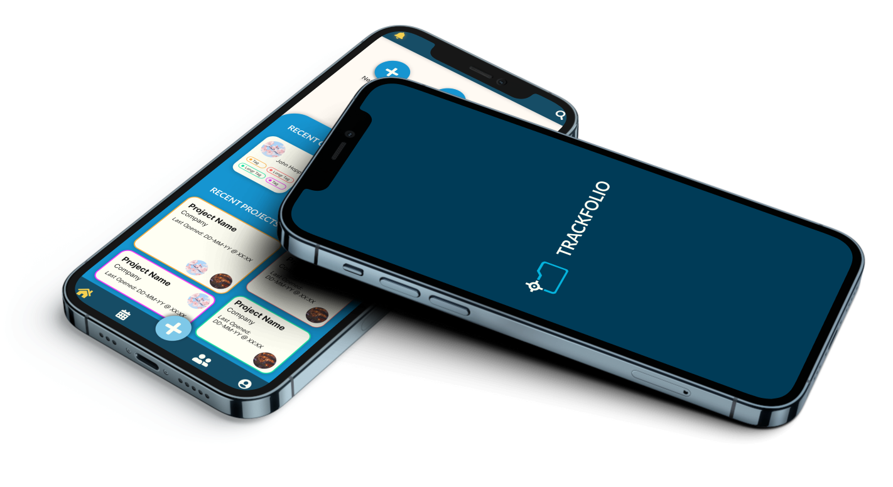

# 📱 TrackFolio

TrackFolio is a real-time, Flutter-based mobile application designed for freelancers and small business owners. It serves as a comprehensive tool to manage projects, clients, tasks, and team members efficiently, aiming to foster better company growth.

## 🚀 Motivation

In a landscape filled with CRM applications built for larger organizations, TrackFolio addresses the unique needs of freelancers and small businesses. Recognizing the market void, we developed TrackFolio to offer a tailored solution that focuses on enhancing productivity and streamlining operations for our target audience.

## ✨ Features

- **Comprehensive Project Management**: Manage all aspects of your projects, from tasks to team collaboration.
- **Client Management**: Keep all your client information organized in one place.
- **Media Attachments**: Attach files and documents directly to projects and tasks.
- **Calendar Integration**: Effortlessly track deadlines, activities, and task due dates.
- **Financial Reporting**: Simplify financial tracking and reporting for your business.
- **Additional Features**: Filter and sort functionality for clients and projects, receive scheduled notifications, view project statistics, and more.

## 🎥 Demo

As of 2024, this mobile app is no longer available on the App/Play Store BUT you are more than welcome to view the <a href="https://www.figma.com/proto/ce90QjuFQqtkcfxaRj1Jfa/Interface-Design?page-id=51%3A111&type=design&node-id=52-1184&viewport=-804%2C464%2C0.33&t=Lo1vDmbdN4ElvoQs-1&scaling=scale-down&starting-point-node-id=52%3A1197&mode=design" target="_blank">Figma prototype here</a>.



## 🛠 Technologies Used

- **Flutter**: For a seamless, native mobile app experience.
- **Firebase**: For real-time data storage and retrieval.

## 🌟 Getting Started

To get a local copy up and running, follow these simple steps:

1. Clone the repository:
    ```sh
    git clone https://github.com/rithik-c/TrackFolio
    ```
2. Navigate to the project directory:
    ```bash
    cd Trackfolio
    ```
3. Install any mobile emulator of your choice (i.e. XCode, Android Studio, etc) & then install dependencies as below:
    ```sh
    flutter pub get
    ```
4. Run the app:
    ```sh
    flutter run
    ```

## 💡 Contributing

We welcome contributions from the community. If you'd like to contribute, please fork the repository and create a pull request with your changes.

## 📄 License

TrackFolio is available under the MIT license. See the LICENSE file for more info.
